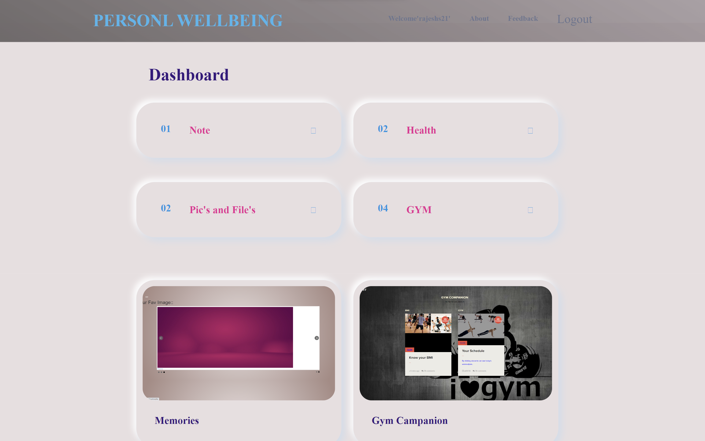

# Personal Management System for Personal Wellbeing


## Project Overview

The Personal Management System for Personal Wellbeing is a comprehensive tool designed to help users keep track of their daily upkeep tasks. This includes managing documents, organizing pictures, jotting down notes, recording work hours, and tracking gym activities. The system is built on a foundation of MySQL for robust database management and a user-friendly front-end interface developed with HTML and CSS.

## Getting Started

To get the project up and running, follow these steps:

1. Clone the repository using the following link: [Personal Management System Repository](https://github.com/rajeshs098/Personal-management-system-Personal-wellbeing-.git)

2. Extract the file named "other" inside 'hddoc' of your XAMPP installation.

3. Insert the provided SQL file into your database.

4. Run the project.

## Database Design

The database design is carefully thought out and includes the following entities and their associated attributes:

- Documents
- Pictures
- Notes
- Work Time
- Gym Activities

Each entity is structured to capture all relevant information for efficient tracking and management.

```sql
-- Example SQL Query to Create Documents Table
CREATE TABLE documents (
  id INT PRIMARY KEY AUTO_INCREMENT,
  title VARCHAR(255) NOT NULL,
  description TEXT,
  file_path VARCHAR(255) NOT NULL,
  uploaded_at TIMESTAMP DEFAULT CURRENT_TIMESTAMP
);
```

## Server-side Development

For server-side development, PHP has been employed to set up a robust backend server. This server handles requests from the front-end interface and implements APIs or endpoints for seamless interaction with the database. CRUD operations (Create, Read, Update, Delete) are also implemented in the server-side logic.

```php
// Example PHP Code for Retrieving Documents
<?php
  $conn = new mysqli($servername, $username, $password, $dbname);

  if ($conn->connect_error) {
    die("Connection failed: " . $conn->connect_error);
  }

  $sql = "SELECT * FROM documents";
  $result = $conn->query($sql);

  if ($result->num_rows > 0) {
    while($row = $result->fetch_assoc()) {
      echo "Title: " . $row["title"]. " - Description: " . $row["description"]. "<br>";
    }
  } else {
    echo "0 results";
  }

  $conn->close();
?>
```

## Contributing

If you'd like to contribute to this project, please follow these steps:

1. Fork the repository.

2. Create a new branch.

3. Make your changes and commit them.

4. Push to your fork and submit a pull request.

## License

This project is licensed under the [MIT License](LICENSE).

## Screenshots




## Acknowledgments

Special thanks to the contributors and libraries that made this project possible.

## Contact

For questions or feedback, please contact [Rajesh S](mailto:rajeshs09858@gmail.com).
```
